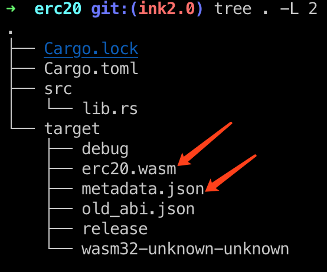

<!-- TOC GFM -->

* [Setup](#setup)
    * [ChainX Binary](#chainx-binary)
    * [Rust Environment for ink!](#rust-environment-for-ink)
    * [ink! CLI](#ink-cli)
* [Creating an ChainX ink! Project](#creating-an-chainx-ink-project)
* [Running a ChainX Node](#running-a-chainx-node)
* [Deploying Your Contract](#deploying-your-contract)
    * [Install the plugin](#install-the-plugin)
    * [Deployment and debug](#deployment-and-debug)
        * [1. Upload of the contract on chain](#1-upload-of-the-contract-on-chain)
            * [UI](#ui)
            * [JS-SDK](#js-sdk)
        * [2. Instantiate of the contract](#2-instantiate-of-the-contract)
            * [UI](#ui-1)
            * [JS-SDK](#js-sdk-1)
        * [3. Call contract functions](#3-call-contract-functions)
            * [UI](#ui-2)
            * [JS-SDK](#js-sdk-2)

<!-- /TOC -->

## Setup

### ChainX Binary

Please go to [chainx-org/ChainX](https://github.com/chainx-org/ChainX) to download the latest version of [ChainX v1.0.7-beta.1](https://github.com/chainx-org/ChainX/releases/tag/v1.0.7-beta.1).

### Rust Environment for ink!

Install Rust environment, please refer to [rust-lang.org/tools/install](https://www.rust-lang.org/tools/install) for details.

### ink! CLI

After the Rust environment is installed, install the command-line tool `cargo-contract` that facilitates the construction of contract projects. Note that please install [chainx-org/cargo-contract ink2.0 branch](https://github.com/chainx-org/cargo-contract/tree/ink2.0), instead of `paritytech/cargo-contract`.

```bash
$ cargo install --git https://github.com/chainx-org/cargo-contract --branch ink2.0 cargo-contract --force
```

## Creating an ChainX ink! Project

`chainx-org/cargo-contract` consists in `paritytech/cargo-contract`: the difference is that `chainx-org/cargo-contract` uses custom `chainx-org/ink` ([ink2.0 branch](https://github.com/chainx-org/ink/tree/ink2.0)), instead of `paritytech/ink`.

Create a _flipper_ sample project:

```bash
$ cargo-contract contract new flipper
```

Run the test:

```bash
$ cd flipper
$ cargo +nightly test
```

Compile the WASM contract file:

```bash
$ cargo-contract contract build
```

Generate contract metadata，which is the contract ABI:

```bash
$ cargo-contract contract generate-metadata
```

A `metadata.json` file is generated in the `target` directory, which contains the necessary information to interact with the contract.

## Running a ChainX Node

Start a single node:

```bash
$ ./chainx --dev --default-log -d <specified_data_directory> --log=runtime=debug --no-telemetry --block-construction-execution=native --other-execution=native
```

For more information about to start a local node, you can read the [ChainX-Dev](https://github.com/chainx-org/ChainX/wiki/ChainX-Dev) wiki. Generally, a single node is sufficient for debugging contracts purpose.

## Deploying Your Contract

### Install the plugin

Click [Chainx Extension](https://chrome.google.com/webstore/detail/chainx-extension/dffjlgnecfafjfmkknpipapcbgajflge) to install the plugin.

> If the plugin cannot be installed because of the network, you can download the plugin compressed package in our [plugin distribution repository](https://github.com/chainx-org/chainx-extension-release) and load it in Chrome browser (please see at readme file on this repository).

After the installation is complete:

1. Switch network to test network

   1.	ChainX currently provides `wss://testnet.w1.org.cn/ws` as default node configuration
   2.	If you are using `ChainX Dev Mode`, you have to add localhost:`ws://localhost:<websocket>`

2. Create or import account


3. If you select "Import Wallet", there is an option to directly import the private key in the upper right corner of the mnemonic page.

### Deployment and debug

The whole process is mainly divided into 3 steps:

1. Upload of the contract on chain (Upload WASM file)
2. Instantiate of the contract (or deploy)
3. Call contract functions

All steps can be performed by UI (https://dapps.chainx.org.cn/), or by JS-SDK script.

#### 1. Upload of the contract on chain

##### UI

1. Open [Chainx Wallet](https://dapps.chainx.org.cn/) and switch to "Contract" page and "Contract Code" tab:


2. Make sure that the compiled `wasm` file and `json` file exist in the `target` directory of your contract directory:



3. Click on "Upload WASM"，and fill in the corrisponding fields in the form:


4. After clicking on "Confirm", the plugin will be called to sign the transaction. Please enter the account password and confirm the signature

5. After the contract is successfully uploaded on chain, it is displayed as follow (including all methods of the contract):


##### JS-SDK

Upload contract using JS-SDK:

``` javascript
const { compactAddLength } = require('@chainx/util');
const code = compactAddLength(fs.readFileSync(path.resolve(__dirname, './erc20.wasm')));

const extrinsic = chainx.api.tx.xContracts.putCode(100000000, code);

let codeHash;

ex.signAndSend(Test, (error, result) => {
  console.log(error, result);
  if (result && result.result === 'ExtrinsicSuccess') {
    // Obtain codeHash
    codeHash = result.events.find(e => e.method === 'CodeStored').event.data;
  }
});
```
If the upload fails, the possible reasons are:

1. The codehash already exists, please copy the hinted codehash and upload the contract via "Add an existing code hash" function
2. Insufficient account balance, please ensure that there are enough PCX in the account used to upload contract
3. "Maximum gas allowed" is not enough, try increasing it and try again

#### 2. Instantiate of the contract

In the previous step about uploading of the contract, we simply stored the contract code on the chain and did not have any functions that can be called, so we need to instantiate this contract.

##### UI

1. Click "Deploy" and fill in the necessary fields for instantiation:


After calling up the plugin, enter the password account and confirm the signature to instantiate the contract.

2. After the contract is successfully deployed, the UI will automatically jump to the "Contract" tab, as shown in the following figure:


3. If the contract is already deployed, click the "Add existing contract" button to add an existing contract. Please note that when adding an existing contract, you need to provide the contract's `abi.json`. If you provide the wrong abi, it will cause a selector error when calling, and the corresponding function cannot be called.

##### JS-SDK

Instantiate the contract using JS-SDK:

``` javascript
// contract abi
const erc20 = require('./erc20');
// parse abi
const Abi = require('@chainx/api-contract');

const abi = new Abi(erc20);
// 5GE7vwvDmKCCPrVLc9XZJAiAspM9LhQWbQjPvZ3QxzBUbhT7
const extrinsic = chainx.api.tx.xContracts.instantiate(
  1000,
  100000000,
  '0x5e71dc66c1527bf4047942c5ada9c5c59941bff8eb8b2d1a6d849306bfd52e93',
  abi.constructors[0](...), // contract constructor
);

let contractAddress

ex.signAndSend(Test, (error, result) => {
  if (result && result.result === 'ExtrinsicSuccess') {
    // get contractAddress
    contractAddress = result.events.find(e => e.method === 'Instantiated').event.data[1];
  }
});
```

#### 3. Call contract functions

##### UI


After the function is successfully executed, the corresponding returned data is displayed in the result area:


##### JS-SDK

Call contract functions using JS-SDK:

``` javascript
const abi = new Abi(erc20);

const ex = chainx.api.tx.xContracts.call(
  '5GE7vwvDmKCCPrVLc9XZJAiAspM9LhQWbQjPvZ3QxzBUbhT7', // contract address
  0, // value
  10000000, // gas
  // called function
  abi.messages.transfer('5FvHGYk44FHZXznrhoskVyr2zGPYn5CpUXphRKM8eGRJZMtX', 10)
);

ex.signAndSend(Alice, (error, result) => {
  console.log(error, result);
});
```
