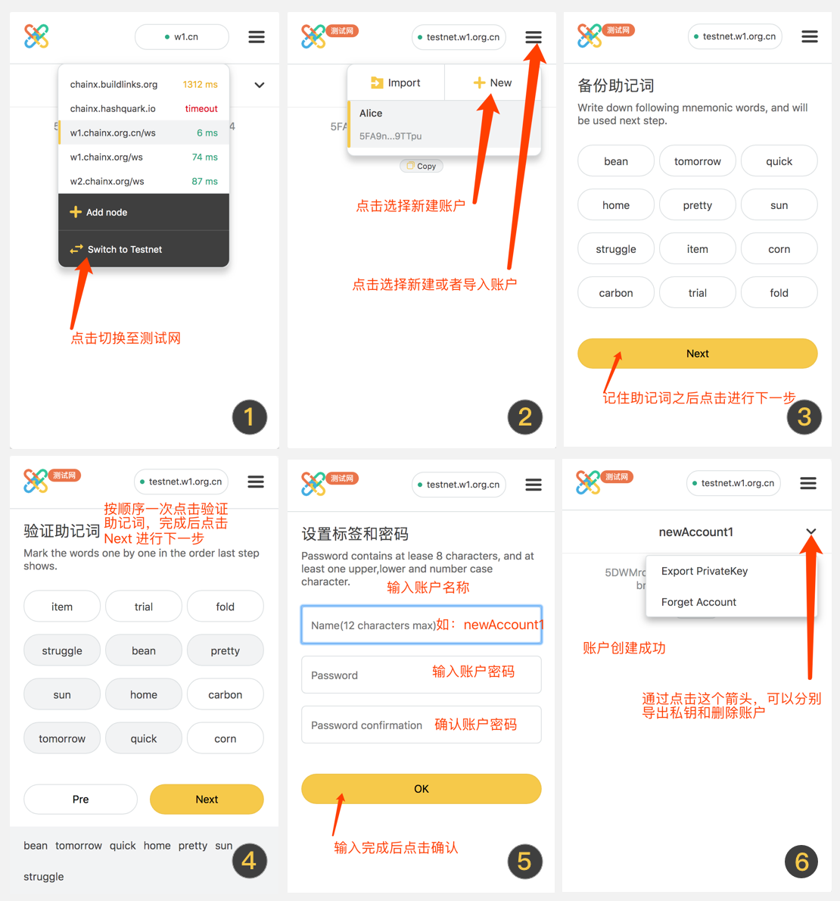
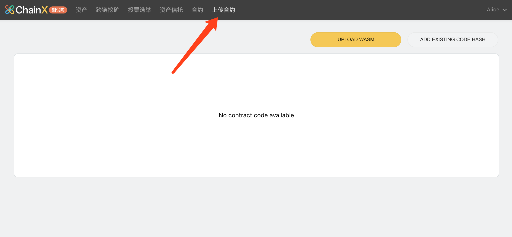
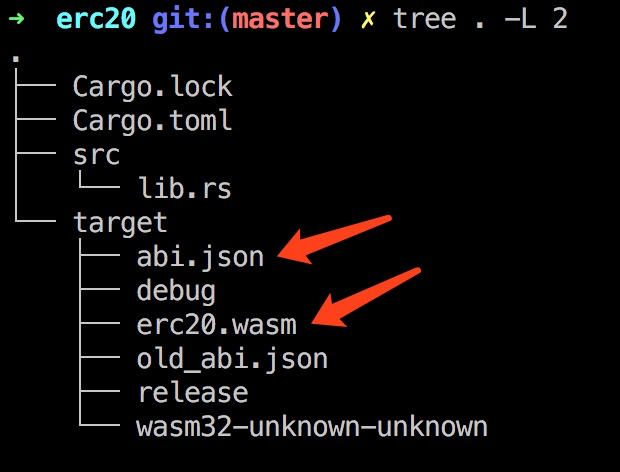
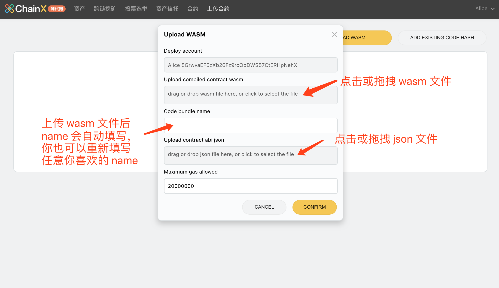
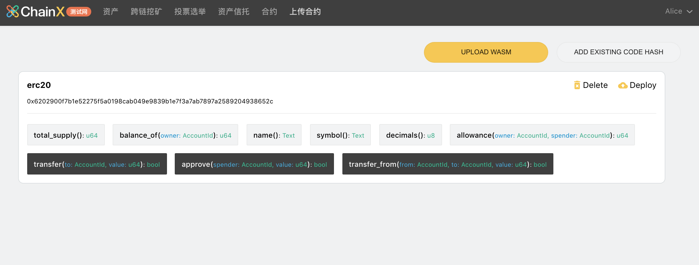
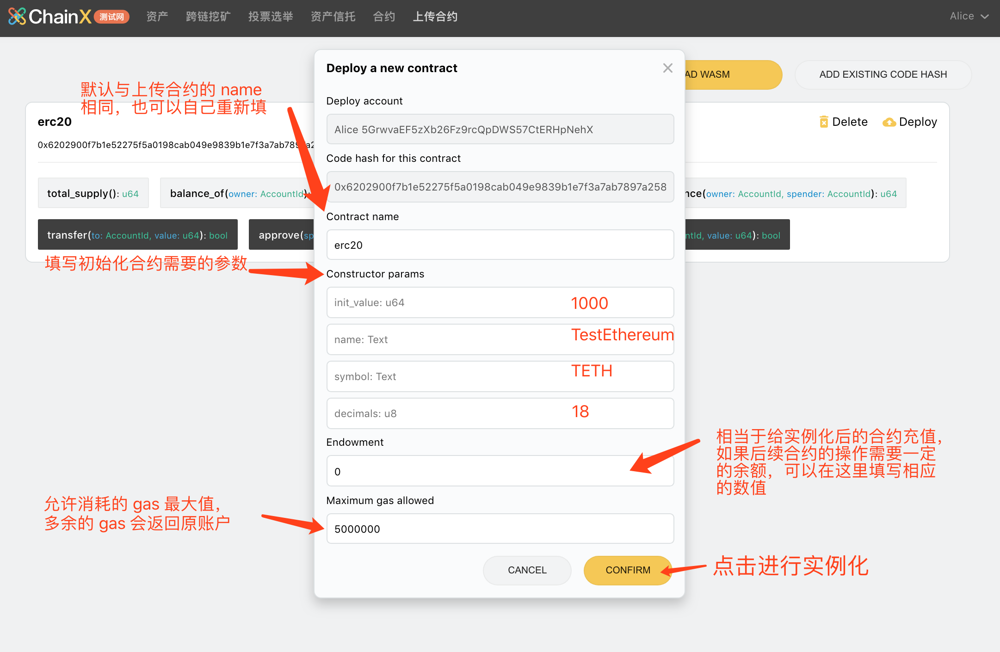
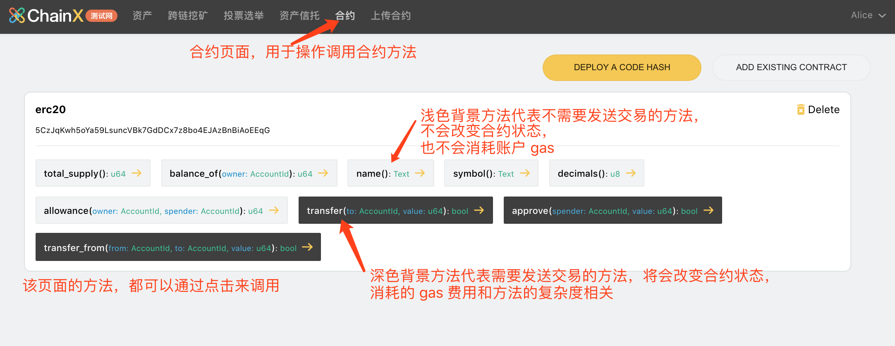
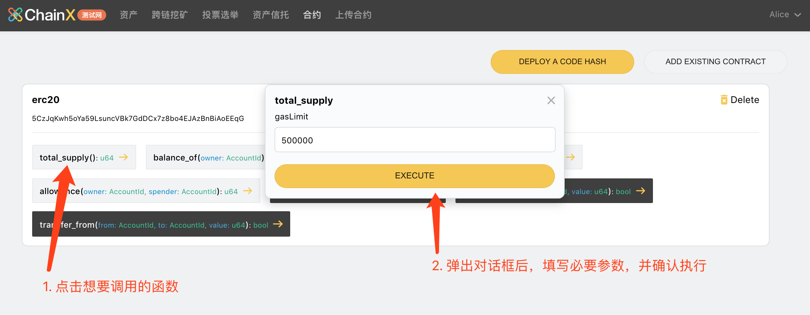
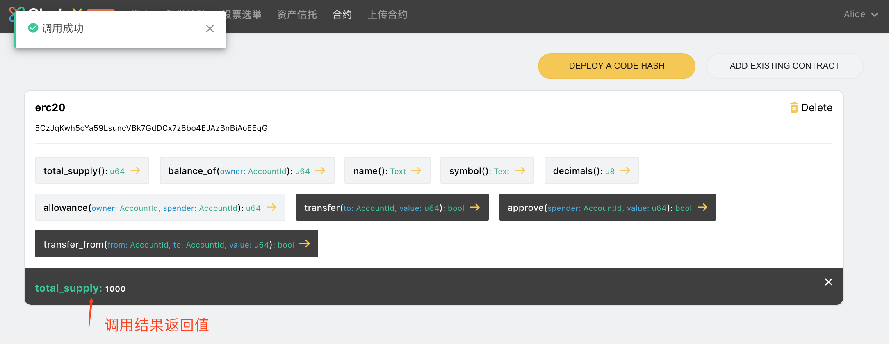

<!-- TOC GFM -->

* [Setup](#setup)
    * [ChainX Binary](#chainx-binary)
    * [Rust Environment for ink!](#rust-environment-for-ink)
    * [ink! CLI](#ink-cli)
* [Creating an ChainX ink! Project](#creating-an-chainx-ink-project)
* [Running a ChainX Node](#running-a-chainx-node)
* [Deploying Your Contract](#deploying-your-contract)
* [Calling Your Contract](#calling-your-contract)

<!-- /TOC -->

## Setup

### ChainX Binary

请前往 [chainx-org/ChainX](https://github.com/chainx-org/ChainX) 下载 [ChainX v1.0.7-alpha](https://github.com/chainx-org/ChainX/releases/tag/v1.0.7-alpha).

### Rust Environment for ink!

安装 Rust 环境， 详情请参考 [rust-lang.org/tools/install](https://www.rust-lang.org/tools/install).

### ink! CLI

安装好 Rust 环境后， 安装方便构建合约项目的命令行工具 `cargo-contract`. 注意，请安装 [chainx-org/cargo-contract ink2.0 branch](https://github.com/chainx-org/cargo-contract/tree/ink2.0), 而不是安装 `paritytech/cargo-contract`。

```bash
$ cargo install --git https://github.com/chainx-org/cargo-contract --branch ink2.0 cargo-contract --force
```

## Creating an ChainX ink! Project

在基本用法上， `chainx-org/cargo-contract` 与 `paritytech/cargo-contract` 一致，区别在于 `chainx-org/cargo-contract` 使用了定制的 `chainx-org/ink`, 而非 `paritytech/ink`。

创建一个 flipper 的示例项目:

```bash
$ cargo-contract new flipper
```

运行测试：

```bash
$ cargo +nightly test
```

编译 WASM 合约文件：

```bash
$ cargo-contract contract build
```

## Running a ChainX Node

启动单节点模式：

```bash
$ ./chainx --dev --default-log -d <指定数据目录> --log=runtime=debug --no-telemetry --block-construction-execution=native --other-execution=native
```

关于本地启动节点的更多内容，可以阅读 wiki [ChainX-Dev](https://github.com/chainx-org/ChainX/wiki/ChainX-Dev), 一般来说调试合约使用单节点模式即可。

## Deploying Your Contract

### 安装插件

点击 [Chainx Extension](https://chrome.google.com/webstore/detail/chainx-extension/dffjlgnecfafjfmkknpipapcbgajflge) 安装插件。

> 如果因为网络无法安装插件，可以在我们的[插件发布仓库](https://github.com/chainx-org/chainx-extension-release)下载插件压缩包，并通过 Chrome 的 Load unpacked 来加载插件。

安装完成之后

1. 将网络切换至测试网

   1.	ChainX当前对于测试网默认提供了`wss://testnet.w1.org.cn/ws` 的节点配置
   2.	如使用`ChainX Dev`模式或者在本地跑了测试网的同步节点，可以添加localhost：`ws://localhost:<websocket的端口>`

2. 新建或者导入账户

   流程如下：

   

3.	在导入钱包界面若选择”导入钱包“，在助记词页面右上角有直接导入私钥的选项。

2. 在浏览器插件中将网络切换到测试网, 合约功能目前只在测试网开启。


### 开始部署并调试

#### 1. 上传合约

1.	打开 [Chainx Wallet](https://dapps.chainx.org.cn/)，并切换到『上传合约』页面：



2.	确保你合约目录的 `target` 目录存在编译好的 `wasm` 文件和 `json` 文件：



3.	点击 UPLOAD WASM，并在表单中上传和填写相应的参数：



4.	点击 CONFIRM 之后，会调起插件对该上传交易进行签名，请输入账户密码并确认签名

5.	合约成功部署后显示如下（包含该合约所有的方法）：



6.	使用 js SDK 上传合约：

``` javascript
const { compactAddLength } = require('@chainx/util');
const code = compactAddLength(fs.readFileSync(path.resolve(__dirname, './erc20.wasm')));

const extrinsic = chainx.api.tx.xContracts.putCode(100000000, code);

let codeHash;

ex.signAndSend(Test, (error, result) => {
  console.log(error, result);
  if (result && result.result === 'ExtrinsicSuccess') {
    // 获取 codeHash
    codeHash = result.events.find(e => e.method === 'CodeStored').event.data;
  }
});
```

>	上传失败可能存在的原因：
>
>		1.	codehash 已存在，请复制提示的 codehash，并通过『Add existing code hash』上传合约代码
>	 	2.	账户余额不足，请保证上传帐号有足够多的 PCX
>	 	3.	gasLimit 不够，请尝试提高 gasLimit 并重试

#### 2. 实例化合约（部署合约）

上一步的上传合约，只是简单的将合约代码存储在链上，还没有任何可以操作和调用的功能，所以接下来我们需要将这份合约进行实例化


1.	点击 Deploy 并填写实例化必要的参数：



调起插件之后，输入密码并确认签名即可实例化合约。

2.	合约部署成功之后，页面会自动跳转到『合约』页面，该页面如下图所示：



3. 若链上已经存在这个合约，可点击`ADD EXISTING CONTRACT`按钮，添加一个已经存在的合约。请注意在添加这个合约实例的时候需要同时提供这个合约的`abi.json`，若提供错误的abi，在调用时会造成selector错误，无法调用对应函数。

4. 使用 js SDK 实例化合约：

``` javascript
// 合约 abi
const erc20 = require('./erc20');
// 解析 abi
const Abi = require('@chainx/api-contract');

const abi = new Abi(erc20);
// 5GE7vwvDmKCCPrVLc9XZJAiAspM9LhQWbQjPvZ3QxzBUbhT7
const extrinsic = chainx.api.tx.xContracts.instantiate(
  1000,
  100000000,
  '0x5e71dc66c1527bf4047942c5ada9c5c59941bff8eb8b2d1a6d849306bfd52e93',
  abi.constructors[0](...), // 合约的构造函数
);

let contractAddress

ex.signAndSend(Test, (error, result) => {
  if (result && result.result === 'ExtrinsicSuccess') {
    // 获取 contractAddress
    contractAddress = result.events.find(e => e.method === 'Instantiated').event.data[1];
  }
});
```

#### 3. 调用合约方法



方法执行成功后会在下方的结果区域显示相应的返回数据：



`total_supply` 与我们初始化合约的时候一致。至此我们的合约上传部署调用就完成了，更多智能合约相关的内容请持续关注我们的官网以及 Github 仓库地址。

使用 js SDK 调用合约方法：

``` javascript
const abi = new Abi(erc20);

const ex = chainx.api.tx.xContracts.call(
  '5GE7vwvDmKCCPrVLc9XZJAiAspM9LhQWbQjPvZ3QxzBUbhT7', // contract address
  0, // value
  10000000, // gas
  // 调用的函数
  abi.messages.transfer('5FvHGYk44FHZXznrhoskVyr2zGPYn5CpUXphRKM8eGRJZMtX', 10)
);

ex.signAndSend(Alice, (error, result) => {
  console.log(error, result);
});
```