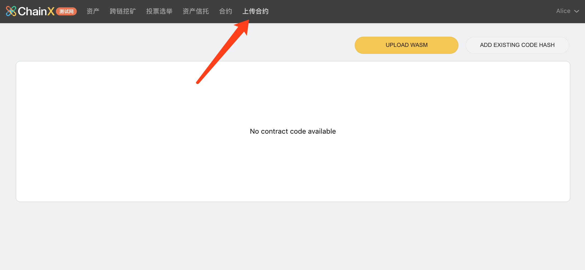
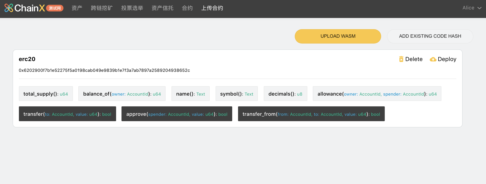

# ChainX 钱包

ChainX的钱包经过迭代后，在将来不再以桌面钱包的形式发布，而改为浏览器插件加网页钱包的形式。因此目前我们将该网页加插件形式的钱包称为**新钱包**，之前的桌面钱包称为**老钱包**

**当前新钱包还处于开发迭代中，未正式发布，因此还存在很多问题。如有问题，请提交到[ChainX钱包的issue](https://github.com/chainx-org/chainx-wallet/issues)中进行反馈**

新钱包将会提供ChainX的智能合约功能，而老钱包将仅仅处于正常维护，不再添加新功能。若使用老钱包，但是需要进行智能合约的开发，我们**仅为开发者提供智能合约开发部分的独立部署组件**，见下文[合约开发独立部署组件](#合约开发独立部署组件)

建议当前ChainX的新钱包仅用于测试网。添加 ChainX 秘书长（WeChat ID：ChainX-PCX），备注『开发群』进群申请测试币

## 新钱包

### 安装插件

点击 [Chainx Extension](https://chrome.google.com/webstore/detail/chainx-extension/dffjlgnecfafjfmkknpipapcbgajflge) 安装插件。

安装完成之后

1. 将网络切换至测试网

   1.	ChainX当前对于测试网默认提供了`wss://testnet.w1.org.cn/ws` 的节点配置
   2.	如使用`ChainX Dev`模式或者在本地跑了测试网的同步节点，可以添加localhost：`ws://localhost:<websocket的端口>`
   3.	若需要连接自己配置的测试网节点，**需要为自己的测试网节点的websocket配置域名及ssh**

2. 新建或者导入账户

   流程如下：

   

3.	在导入钱包界面若选择”导入钱包“，在助记词页面右上角有直接导入私钥的选项。

### 体验钱包

#### 其他功能部分

该钱包其他功能与老钱包相似，敬请体验。

#### 合约功能部分

##### 1. 上传合约

1.	打开 [Chainx Wallet](https://dapps.chainx.org.cn/)，并切换到『上传合约』页面：

2.	确保你合约目录的 `target` 目录存在编译好的 `wasm` 文件和 `json` 文件：

3.	点击 UPLOAD WASM，并在表单中上传和填写相应的参数：

4.	点击 CONFIRM 之后，会调起插件对该上传交易进行签名，请输入账户密码并确认签名：

5.	合约成功部署后显示如下（包含该合约所有的方法）：

>	上传失败可能存在的原因：
>
>		1.	codehash 已存在，请复制提示的 codehash，并通过『Add existing code hash』上传合约代码
>	 	2.	账户余额不足，请保证上传帐号有足够多的 PCX
>	 	3.	gasLimit 不够，请尝试提高 gasLimit 并重试

##### 2. 实例化合约（部署合约）

上一步的上传合约，只是简单的将合约代码存储在链上，还没有任何可以操作和调用的功能，所以接下来我们需要将这份合约进行实例化

1.	点击 Deploy 并填写实例化必要的参数：

调起插件之后，输入密码并确认签名即可实例化合约。

2.	合约部署成功之后，页面会自动跳转到『合约』页面，该页面如下图所示：

##### 3. 调用合约方法

方法执行成功后会在下方的结果区域显示相应的返回数据：

`total_supply` 与我们初始化合约的时候一致。至此我们的合约上传部署调用就完成了，更多智能合约相关的内容请持续关注我们的官网以及 Github 仓库地址。

### ChainX上的X-BTC资产与合约中的XRC20-BTC互相划转

// TODO 

## 合约开发独立部署组件

// TODO

## 老钱包

**老钱包将来不会提供新功能，仅进行正常维护**

* 主网：请下载最新的钱包，链接[下载](https://github.com/chainx-org/chainx-wallet/releases)
* 测试网：对于当前ChainX Testnet Taoism，请下载目前pre-release钱包，链接[下载](#)

### 老钱包连接测试网

自`v1.0.4`版本之后提供了切换测试网的功能：

1. 点击钱包右上角设置按钮
2. 选择网络类型中选择“测试网”，选择后，钱包页面会进行重置，此时钱包中的存储将会使用全新的存储，和主网存储隔离
3. 点击“添加节点”，可以添加**测试网节点**的websocket地址和端口，如本机启动默认配置时，指定为`127.0.0.1:8087`
4. 选择右下角的网络为刚才添加的节点
5. 鼠标移动到右上角设置左边的按钮，点击创建账户/导入账户
   1. 在导入账户页面可以选择助记词/keystore/私钥进行导入