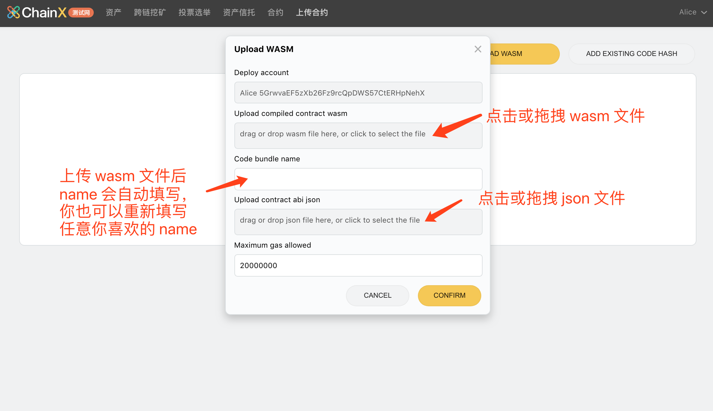
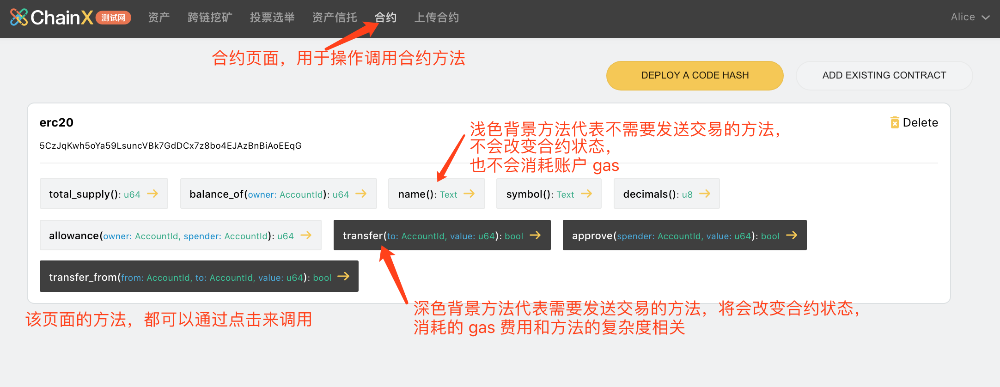
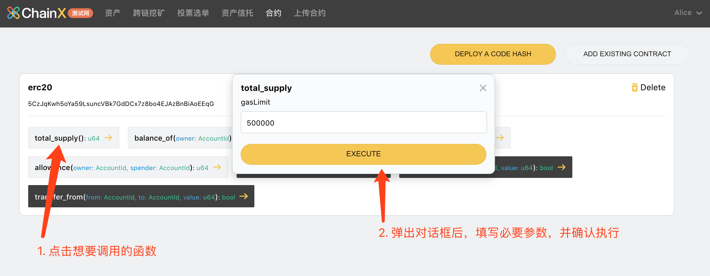

# ChainX 钱包

ChainX的钱包经过迭代后，在将来不再以桌面钱包的形式发布，而改为浏览器插件或Signer加网页钱包的形式。因此目前我们将该网页加插件或signer形式的钱包称为**新钱包**，之前的桌面钱包称为**老钱包**。

**当前新钱包正式对外开放测试，可能会存在一些问题。如有问题，请提交issue到[chainx-wallet-bug-bounty](https://github.com/chainx-org/chainx-wallet-bug-bounty/issues)中进行反馈，对于有价值的issue，您将获得PCX奖励**

## 新钱包

**ChainX新钱包为网页钱包+Signer或插件（Chrome和Edge插件）的形式。**

钱包地址：[https://dapps.chainx.org](https://dapps.chainx.org)  
备用地址：[https://dapps.chainx.org.cn](https://dapps.chainx.org.cn)

**目前新版钱包只支持[Chrome](https://www.google.com/chrome/)和[Edge](https://www.microsoft.com/en-us/edge)浏览器，使用其他浏览器可能会遇到样式及插件无法安装的问题。**

### 安装ChainX signer

下载地址： https://github.com/chainx-org/chainx-signer/releases

### 安装插件

如果您使用Chrome浏览器，请前往[Chrome web store](https://chrome.google.com/webstore/detail/chainx-extension/dffjlgnecfafjfmkknpipapcbgajflge)下载；如果是Edge浏览器，请前往[Edge Addons](https://microsoftedge.microsoft.com/addons/detail/pglmaogdhpmengmblgdjgnnabbafegkk)下载。

安装完成之后

1. 新建或者导入账户

   流程如下：

   

2.	在导入钱包界面若选择”导入钱包“，在助记词页面右上角有直接导入私钥的选项。

### 体验钱包

请在钱包页面右上角打开账户列表，在安装完ChainX signer或插件的前提下，选择连接Signer或插件。钱包会从Signer或插件中获取当前账户，页面会显示当前地址的最新资产信息。

#### 其他功能部分

该钱包其他功能与老钱包相似，敬请体验。

#### 合约功能部分

##### 1. 上传合约

1.	打开 [Chainx Wallet](https://dapps.chainx.org.cn/)，并切换到『上传合约』页面：

2.	确保你合约目录的 `target` 目录存在编译好的 `wasm` 文件和 `json` 文件：

3.	点击 UPLOAD WASM，并在表单中上传和填写相应的参数：

4.	点击 CONFIRM 之后，会调起插件对该上传交易进行签名，请输入账户密码并确认签名：

5.	合约成功部署后显示如下（包含该合约所有的方法）：

>	上传失败可能存在的原因：
>
>		1.	codehash 已存在，请复制提示的 codehash，并通过『Add existing code hash』上传合约代码
>	 	2.	账户余额不足，请保证上传帐号有足够多的 PCX
>	 	3.	gasLimit 不够，请尝试提高 gasLimit 并重试

##### 2. 实例化合约（部署合约）

上一步的上传合约，只是简单的将合约代码存储在链上，还没有任何可以操作和调用的功能，所以接下来我们需要将这份合约进行实例化

1.	点击 Deploy 并填写实例化必要的参数：

调起插件之后，输入密码并确认签名即可实例化合约。

2.	合约部署成功之后，页面会自动跳转到『合约』页面，该页面如下图所示：

3. 若链上已经存在这个合约，可点击`ADD EXISTING CONTRACT`按钮，添加一个已经存在的合约。请注意在添加这个合约实例的时候需要同时提供这个合约的`abi.json`，若提供错误的abi，在调用时会造成selector错误，无法调用对应函数。

##### 3. 调用合约方法

方法执行成功后会在下方的结果区域显示相应的返回数据：

`total_supply` 与我们初始化合约的时候一致。至此我们的合约上传部署调用就完成了，更多智能合约相关的内容请持续关注我们的官网以及 Github 仓库地址。

### ChainX上的X-BTC资产与合约中的XRC20-BTC互相划转

// TODO 

## 合约开发独立部署组件

// TODO

## 老钱包

**老钱包将来不会提供新功能，仅进行正常维护**

* 主网：请下载最新的钱包，链接[下载](https://github.com/chainx-org/chainx-wallet/releases)
* 测试网：对于当前ChainX Testnet Taoism，请下载目前pre-release钱包，链接[下载](https://github.com/chainx-org/chainx-wallet/releases/tag/v1.0.10)

### 老钱包连接测试网

自`v1.0.4`版本之后提供了切换测试网的功能：

1. 点击钱包右上角设置按钮
2. 选择网络类型中选择“测试网”，选择后，钱包页面会进行重置，此时钱包中的存储将会使用全新的存储，和主网存储隔离
3. 点击“添加节点”，可以添加**测试网节点**的websocket地址和端口，如本机启动默认配置时，指定为`127.0.0.1:8087`
4. 选择右下角的网络为刚才添加的节点
5. 鼠标移动到右上角设置左边的按钮，点击创建账户/导入账户
   1. 在导入账户页面可以选择助记词/keystore/私钥进行导入
