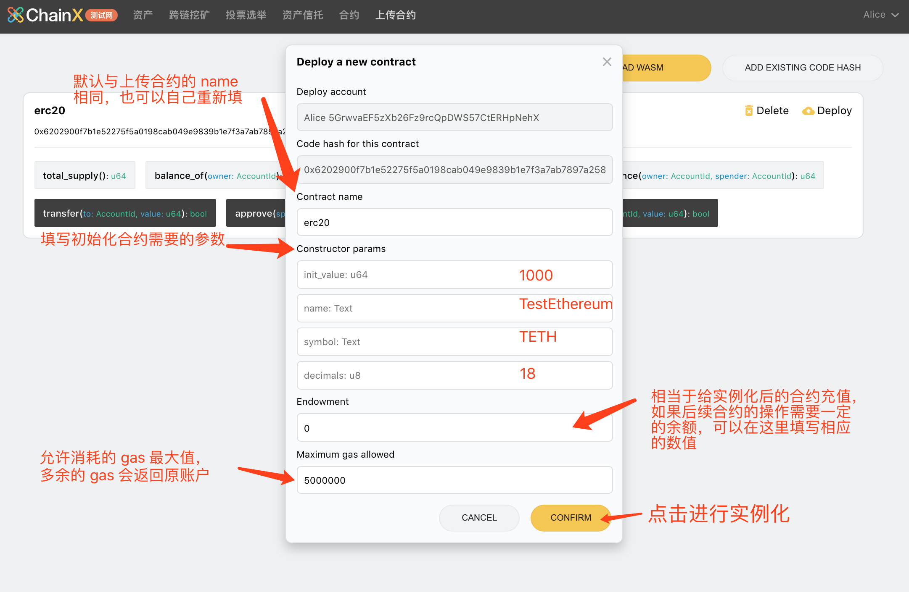

### 安装插件

点击 [Chainx Extension](https://chrome.google.com/webstore/detail/chainx-extension/dffjlgnecfafjfmkknpipapcbgajflge) 安装插件。

安装完成之后

1.	将网络切换至测试网
2.	新建或者导入账户
3.	添加 ChainX 秘书长（WeChat ID：ChainX-PCX），备注『开发群』进群申请测试币

### 上传合约

1.	打开 [Chainx Wallet](https://dapps.chainx.org.cn/)，并切换到『上传合约』页面：

2.	确保你合约目录的 `target` 目录存在编译好的 `wasm` 文件和 `json` 文件：

3.	点击 UPLOAD WASM，并在表单中上传和填写相应的参数：

4.	点击 CONFIRM 之后，会调起插件对该上传交易进行签名，请输入账户密码并确认签名：

5.	合约成功部署后显示如下（包含该合约所有的方法）：

>	上传失败可能存在的原因：
>
>		1.	codehash 已存在，请复制提示的 codehash，并通过『Add existing code hash』上传合约代码
>	 	2.	账户余额不足，请保证上传帐号有足够多的 PCX
>	 	3.	gasLimit 不够，请尝试提高 gasLimit 并重试

### 实例化合约（部署合约）

上一步的上传合约，只是简单的将合约代码存储在链上，还没有任何可以操作和调用的功能，所以接下来我们需要将这份合约进行实例化

1.	点击 Deploy 并填写实例化必要的参数：

调起插件之后，输入密码并确认签名即可实例化合约。

2.	合约部署成功之后，页面会自动跳转到『合约』页面，该页面如下图所示：

### 调用合约方法

方法执行成功后会在下方的结果区域显示相应的返回数据：

`total_supply` 与我们初始化合约的时候一致。至此我们的合约上传部署调用就完成了，更多智能合约相关的内容请持续关注我们的官网以及 Github 仓库地址。
